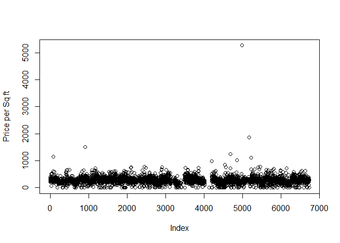

# 2016-0509-6306_Rolling_Sales_Analysis_StatenIsland
Manjula Kottegoda  
June 8, 2016  

***

## Rolling Sales Analysis Staten Island

This is to load and examine the Staten Island Rolling sales data as part of Live Session 04 Assignment for Group 4 (consisting of Gopinath Mavankal, Olasehinde Ogunbeku, Ryan Kelly and Manjula Kottegoda)

First we load the data. Raw file and a copy of partially cleansed data in to a master dataframe for analysis. Partial cleansing  steps given in readme.

Initial views of the data show outliers that cloud the general patterns.

<!-- -->

Outliers are more visible in this view from the partially cleansed data file as well. Majority of the population is below the $ 1000/Sqft price point.

<!-- -->

Using the Partially cleaned data we do the following analysis for the lower price point.

Figure 2.1 (below) shows all counts where price per square foot is less than $1000. We have omitted high value outliers in this view. The count in the lowest price point 'bucket' shows an abnormal spike. This is because of multiple sub $100 sales. These typically account for transfer of ownership rather than an actual sale. Figure 2.2 shows a more realistic market view on price vs. demand. 

<!-- --><!-- -->

As seen in Figure 2.2 median price per square foot in Staten Island for sub 1000 range is $270.83. Overall Median price per square foot for entire borough of Staten Island is $294.4. 

Furthermore the Median sales price for the entire borough of Staten Island is **$ 405000.00**.

The graph below shows the sales by neighborhood. The view below shows the most to least desirable  neighborhoods based on sales.

<!-- -->

The graph below shows the number of sales for the 12 month period showing the seasonal effects on the market.

<!-- -->

